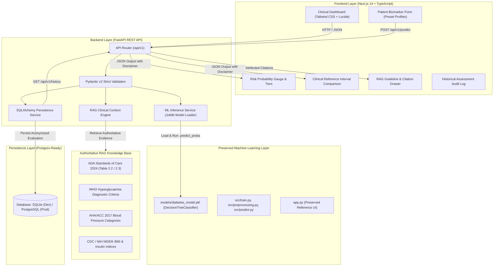

# Medical Report Intelligence 🩺
### AI-Powered Clinical Decision Support & Metabolic Risk Analytics

[](https://fastapi.tiangolo.com)
[](https://nextjs.org/)
[](https://www.typescriptlang.org/)
[](https://scikit-learn.org/)
[](https://www.sqlalchemy.org/)
[](https://www.docker.com/)

**Medical Report Intelligence** is an enterprise-grade medical decision-support platform designed to demonstrate modern full-stack AI engineering. It couples a machine learning classification engine (**DecisionTreeClassifier**) with a **Retrieval-Augmented Generation (RAG)** clinical reference subsystem grounded in accredited clinical guidelines from the **American Diabetes Association (ADA)**, **World Health Organization (WHO)**, **American Heart Association (AHA)**, and **CDC/NIH**.

---

## ⚕️ Important Clinical Disclaimer

> [!IMPORTANT]
> **AI-Assisted Decision Support & Educational Demonstration Only**
>
> This platform and its machine learning models are designed solely for clinical screening evaluation, educational research, and technical portfolio demonstration.
> - **It does NOT provide definitive medical diagnosis.**
> - **It does NOT evaluate individual pharmacological treatments or prescribe medication.**
> - The RAG subsystem provides strictly informational population reference ranges and guidelines.
> - All assessments require formal venous blood laboratory analysis evaluated by a licensed healthcare physician.

---

## 🏗️ System Architecture



---

## 🌟 6 Core Technology Demonstrations

### 1. Modern Next.js Frontend
- **Framework**: Next.js 14 (App Router) + TypeScript + Tailwind CSS.
- **Clinical UI**: Interactive 8-biomarker evaluation form, clinical presets (Low Risk, Borderline, High Risk, Healthy Baseline), real-time risk gauges, biomarker delta comparison tables, and RAG guideline drawers.
- **Deployment Ready**: Configured for instant deployment on **Vercel** (`frontend/vercel.json`).

### 2. Python ML Backend
- **Framework**: FastAPI with asynchronous endpoints and Pydantic v2 data validation.
- **Model Preservation**: Uses the exact trained `models/diabetes_model.pkl` (**DecisionTreeClassifier**) trained on the Pima Indians Diabetes dataset.
- **Unchanged ML Logic**: Preserves all 8 clinical predictors in exact order (`Pregnancies`, `Glucose`, `BloodPressure`, `SkinThickness`, `Insulin`, `BMI`, `DiabetesPedigreeFunction`, `Age`).
- **Interactive Documentation**: Auto-generated Swagger/OpenAPI documentation at `/docs`.

### 3. Database Layer (PostgreSQL-Ready)
- **Engine**: SQLAlchemy 2.0 ORM.
- **Dual-Mode**: Runs zero-configuration SQLite (`reports.db`) locally and automatically adapts to **PostgreSQL** in production via the `DATABASE_URL` environment variable.
- **Privacy-Conscious**: Zero Personally Identifiable Information (PII) collected. Records are indexed using anonymized session UUIDs (`PT-XXXXXXXX`).

### 4. Authoritative & Attributed RAG System
- **Strictly Grounded**: Exclusively utilizes accredited medical standards:
  - **American Diabetes Association (ADA)**: *Standards of Care in Diabetes (2024)*.
  - **World Health Organization (WHO)**: *Diagnostic Criteria for Diabetes Mellitus & Intermediate Hyperglycaemia*.
  - **American Heart Association (AHA) / ACC**: *2017 Blood Pressure Guidelines*.
  - **CDC & NIH (NIDDK)**: *Adult BMI & Serum Insulin Physiological Standards*.
- **Strictly Informational**: Compares entered biomarkers to normal reference intervals, explains which values fall outside standard bounds, and cites sources with DOIs. **Strictly non-diagnostic and non-prescriptive.**

### 5. Git & GitHub Architecture
- **Clean Structure**: Decoupled monorepo separating `frontend/`, `backend/`, and preserved `models/` / `src/` directories.
- **Enterprise `.gitignore`**: Protects virtual environments, database files, node modules, and secrets.
- **Automated CI/CD**: GitHub Actions workflow (`.github/workflows/ci.yml`) runs Pytest backend test suites and Next.js type check builds on every push.

### 6. Deployment Architecture
- **Frontend Cloud**: Ready for **Vercel** with `vercel.json` and configurable `NEXT_PUBLIC_API_URL`.
- **Backend Cloud**: Ready for **Render** / **Railway** with `backend/render.yaml`, `backend/Procfile`, and dynamic `$PORT` binding.
- **Containerization**: Multi-stage `Dockerfile`s for both services and root `docker-compose.yml` for unified one-command startup (`docker compose up --build`).

---

## 📁 Repository Structure

```text
Medical-Report-Intelligence/
│
├── .github/
│   └── workflows/
│       └── ci.yml                      # GitHub Actions CI for pytest & build
│
├── backend/                            # FastAPI ML & RAG Backend
│   ├── app/
│   │   ├── main.py                     # FastAPI entry point & CORS
│   │   ├── config.py                   # Settings & dynamic DATABASE_URL
│   │   ├── api/                        # REST endpoints (/predict, /history, /rag, /health)
│   │   ├── schemas/                    # Pydantic v2 schemas
│   │   ├── services/                   # ML inference, RAG retrieval, DB persistence
│   │   ├── db/                         # SQLAlchemy engine & AssessmentRecord ORM
│   │   └── data/medical_knowledge/     # Authoritative ADA, WHO, AHA, CDC guidelines
│   ├── tests/
│   │   ├── test_inference.py           # Model verification & parity test
│   │   └── test_api.py                 # API integration test suite
│   ├── Dockerfile                      # Production backend Dockerfile
│   ├── render.yaml                     # Render Infrastructure-as-Code manifest
│   ├── Procfile                        # Railway / Heroku process definition
│   ├── requirements.txt                # Python dependencies
│   └── .env.example
│
├── frontend/                           # Next.js 14 Frontend Application
│   ├── src/
│   │   ├── app/
│   │   │   ├── page.tsx                # Assessment dashboard
│   │   │   ├── history/page.tsx        # Audit log table
│   │   │   ├── about/page.tsx          # Architecture & clinical standards
│   │   │   └── layout.tsx              # Root layout & navbar
│   │   ├── components/                 # AssessmentForm, RiskGauge, BiomarkerRadar, RagDrawer
│   │   ├── lib/                        # Typed API client & clinical presets
│   │   └── types/                      # TypeScript definitions
│   ├── Dockerfile                      # Production frontend Dockerfile
│   ├── vercel.json                     # Vercel deployment configuration
│   ├── package.json                    # Node dependencies & build scripts
│   └── .env.example
│
├── data/                               # [PRESERVED UNTOUCHED]
│   └── diabetes.csv                    # Training dataset
│
├── models/                             # [PRESERVED UNTOUCHED]
│   └── diabetes_model.pkl              # Existing DecisionTreeClassifier
│
├── src/                                # [PRESERVED UNTOUCHED]
│   ├── preprocessing.py
│   ├── train.py
│   └── predict.py
│
├── app.py                              # [PRESERVED UNTOUCHED] Legacy Streamlit reference UI
├── docker-compose.yml                  # Unified multi-service orchestration
├── .gitignore                          # Comprehensive multi-stack ignore rules
├── requirements.txt                    # Root requirements
└── README.md                           # Enterprise portfolio documentation
```

---

## 🚀 Quick Start Guide

### Option A: Local Development (Recommended)

#### 1. Start the FastAPI Backend
```powershell
# Activate Python virtual environment
.\venv\Scripts\Activate.ps1

# Start the API server
uvicorn backend.app.main:app --reload --port 8000
```
- API Documentation: [http://localhost:8000/docs](http://localhost:8000/docs)
- Health Check: [http://localhost:8000/api/v1/health](http://localhost:8000/api/v1/health)

#### 2. Start the Next.js Frontend
```bash
cd frontend
npm install
npm run dev
```
- Open [http://localhost:3000](http://localhost:3000) to access the interactive clinical dashboard.

#### 3. (Optional) Run the Legacy Streamlit App
Your original Streamlit interface remains completely preserved:
```bash
streamlit run app.py
```

---

### Option B: Docker Compose (One-Command Startup)

Run both the Next.js frontend and FastAPI backend inside isolated containers:

```bash
docker compose up --build
```
- Frontend: `http://localhost:3000`
- Backend: `http://localhost:8000`

---

## ☁️ Production Cloud Deployment Guide

### Frontend Deployment (Vercel)
1. Push this repository to GitHub.
2. In [Vercel](https://vercel.com), import the repository and set the **Root Directory** to `frontend`.
3. Set the Environment Variable:
   ```env
   NEXT_PUBLIC_API_URL=https://your-backend-service.onrender.com/api/v1
   ```
4. Click **Deploy**. Vercel will build and host the Next.js application automatically.

### Backend Deployment (Render / Railway)
1. In [Render](https://render.com), create a new **Web Service** pointing to this repository.
2. Render automatically detects `backend/render.yaml` or you can manually configure:
   - **Root Directory**: `backend` (or project root)
   - **Build Command**: `pip install -r backend/requirements.txt`
   - **Start Command**: `uvicorn backend.app.main:app --host 0.0.0.0 --port $PORT`
3. Attach a **Render PostgreSQL** database (or use Supabase/Neon) and provide the `DATABASE_URL` environment variable. The SQLAlchemy layer automatically connects and initializes tables.

---

## 🧪 Testing & Validation

Run the automated backend test suite with Pytest:

```bash
.\venv\Scripts\python.exe -m pytest backend/tests/ -v
```

All 8 test suites verify:
- Exact model prediction and probability match with `models/diabetes_model.pkl`.
- Pydantic input validation error handling.
- RAG guideline retrieval and citation structure.
- SQLAlchemy database audit logging.
